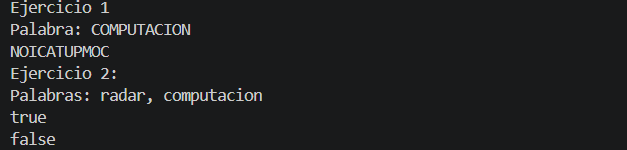

# Práctica: Estructuras Dinámicas Lineales

## Datos del Estudiante
- **Nombre:** Gabriel Cuenca
- **Curso:** 3
- **Fecha:** 09/06/2026

---

## 1. 

**Fecha:** 09/06/2026

**Descripción:**

Se relizaron ejercicios sobre invertir cadenas de texto con pila.

### Captura de salida en consola



### Código de implementación del ejercicio 1


```java
public String invertString(String texto) {
        ArrayDeque<Character> pila = new ArrayDeque<>();
        for (char letra : texto.toCharArray())
            pila.push(letra);
        String invertido = "";
        while (!pila.isEmpty())
            invertido += pila.pop();
        return invertido;
    }
```

## 2.

**Fecha:** 09/06/2026

**Descripción:**

Se relizaron ejercicios sobre comprobar si son palindromos con pila.

### Captura de salida en consola


### Código de implementación del ejercicio 2


```java
public boolean esPalindromo(String texto){
        ArrayDeque<Character> pila = new ArrayDeque<>();
        for (char letra : texto.toCharArray())
            pila.push(letra);
        for (char letra : texto.toCharArray())
            if(letra != pila.pop()) return false;
        return true;
    }
```

